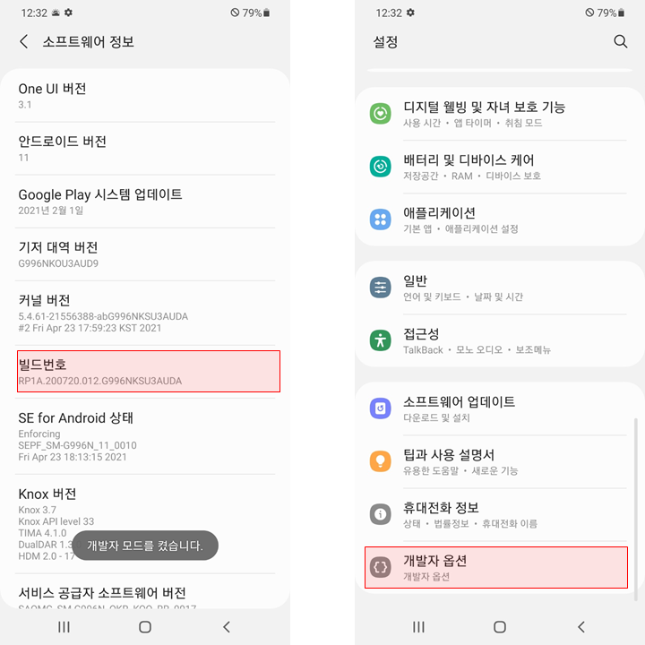
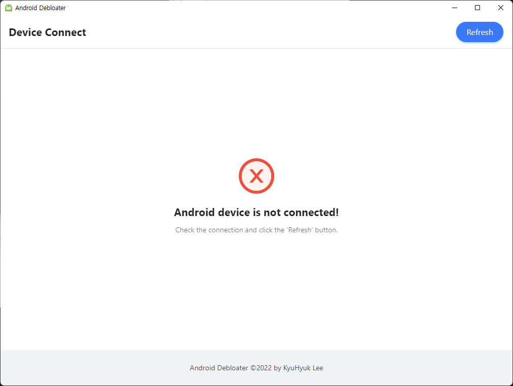
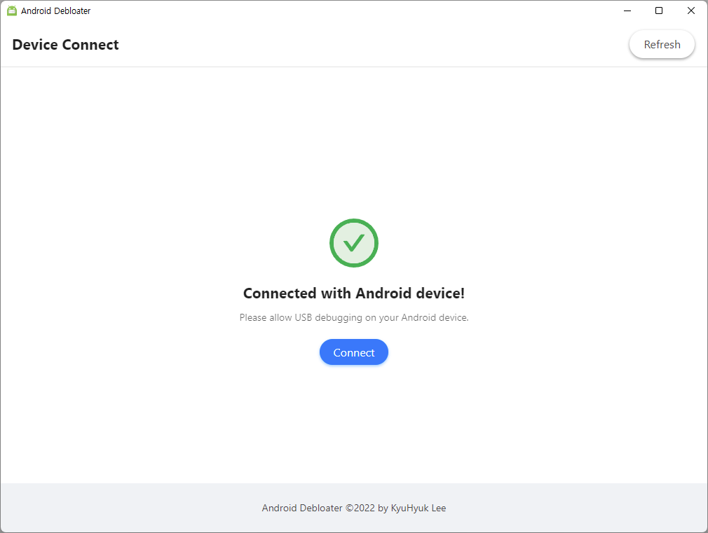
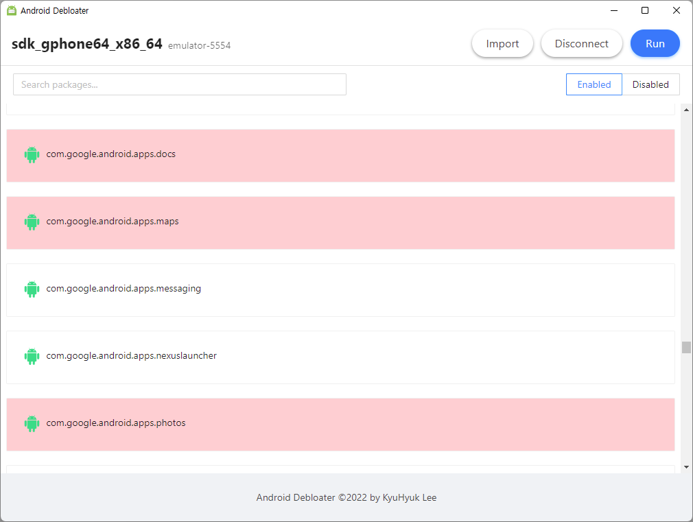
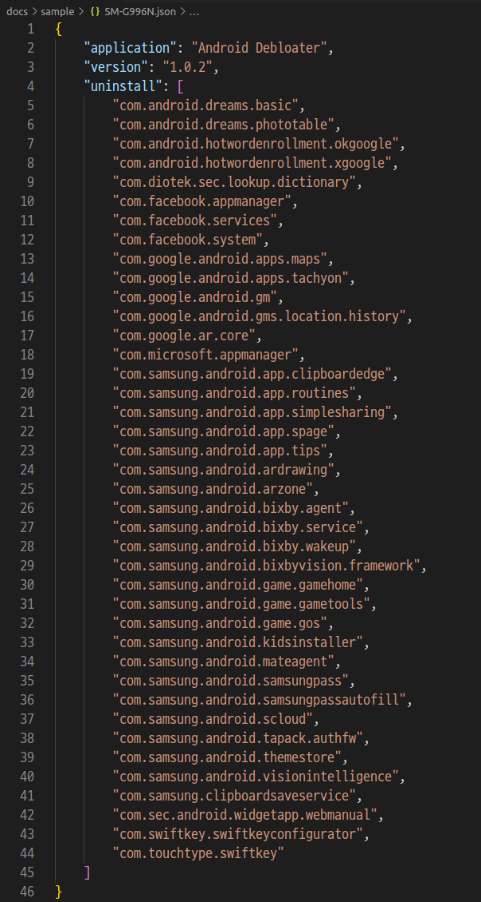

# Android Debloater v1.0.1

Android Debloater는 안드로이드 스마트폰에 있는 원치 않는 애플리케이션과 기본 탑재 애플리케이션을 제
거하는 데 도움을 줍니다.

## 주의 사항

**Android Debloater로 시스템 동작과 관련된 애플리케이션을 제거하게 되면 시스템이 비정상으로 동작하여
휴대폰을 초기화 해야할수도 있습니다. 사용에 주의 해주세요.**

## 사용 방법

1. Android 기기에서 '빌드 번호'를 여러 번 터치하며 '개발자 옵션'을 활성화합니다.  
   

2. '개발자 옵션'에 들어가서 'USB 디버깅'을 활성화 합니다.  
   

3. 'Android Debloater'를 실행하고, Android 기기와 PC를 연결합니다.  
   아래와 같이 'USB 디버깅을 허용하시겠습니까?'라는 창이 출력되면, '이 컴퓨터에서 항상 허용'을 선택
   하고, '허용' 버튼을 누릅니다.  
   

4. 위의 과정을 모두 진행했는데 아래와 같이 'Android device is not connected!'라는 문구가 화면에 보여
   지면, 'Refresh' 버튼을 눌러 새로고침 합니다.  
   

5. 'Connected with Android device!' 문구가 출력되면, 'Connect' 버튼을 누릅니다.  
   

6. 아래 화면에서 제거하고 싶은 애플리케이션을 선택합니다.  
   'Import' 버튼을 누르면, 다른 사람이 미리 설정한 제거 리스트를 불러올 수 있습니다.  
   제거할 애플리케이션을 선택한 뒤 'Run' 버튼을 누릅니다.  
   

7. 제거할 애플리케이션의 리스트를 보여줍니다.  
   위의 화면에서 'Export' 버튼을 누르면 제거할 리스트를 JSON 형식으로 내보낼수있으며, 이 파일을 공유
   하면 다른 사용자들이 'Import'하여 사용이 가능합니다. 'Run' 버튼을 누르면, 제거를 진행합니다.  
   

8. 아래와 같이 제거되는 과정과 결과가 출력됩니다.  
   'Done'이라는 메시지가 출력되면 모든 작업이 완료된 것입니다.  
   

## Uninstall List Format

'Export' 버튼을 눌러 추출된 파일의 형식은 아래와 같습니다.

- `application` : 해당 파일을 추출한 프로그램의 이름입니다.
- `version` : 해당 파일을 추출한 프로그램의 버전입니다.
- `uninstall` : 제거할 애플리케이션의 목록입니다.

